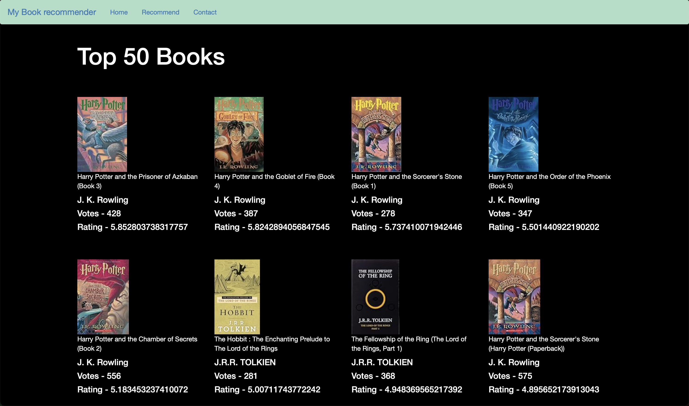

# 📚 Book Recommendation Website

A simple and interactive **Book Recommendation Web App** built using **Flask**.  
It allows users to explore the **top 50 most popular books** on the homepage and get **personalized book recommendations** (top 4 similar books) by entering a book name.

---

## 🚀 Features

- ✅ Display of **Top 50 Popular Books** on the homepage.
- ✅ Recommend **Top 4 similar books** based on a selected book.
- ✅ Simple and user-friendly **web interface** using `index.html` and `recommend.html`.
- ✅ Backend powered by **Flask** using `render_template`.
- ✅ Uses `requests` module to manage data interactions (if external APIs used).

---

## 📁 Project Structure

book_recommendation/
├── app.py
├── templates/
│ ├── index.html
│ └── recommend.html
├── static/ (optional: CSS, images)
├── books.pkl (optional: pickled data for book info)
├── similarity.pkl (optional: pickled similarity matrix)
|__ dataset
└── README.md
# 📚 Book Recommendation Website

A Flask-based book recommender showing top books and suggestions.

## 🔻 Screenshot

